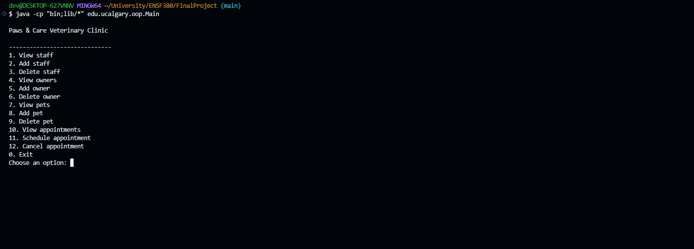

# Paws & Care Veterinary Clinic

This program uses JDBC to connect to PostgreSQL. The connection settings are
stored in `db.properties` so the database name, username, or password can be
changed without modifying the Java code just to make it easier for our professor or TA to mark! We use gitbash as our terminal for most things, so the directions are provided for it. Powershell and zsh are incredibly similar too.

## Database Setup

Log in as `postgres`, then run:

```sql
CREATE ROLE oop WITH LOGIN PASSWORD 'ucalgary';
CREATE DATABASE vet_clinic OWNER oop;
```

Then to load the tables with our sql files data we run:

```bash
psql -U oop -d vet_clinic -f clinic_database.sql
```

Run the SQL file only once, otherwise it can cause duplicates to show. Java then connects using `db.properties` for ease of connection.

## Compile and Run

To compile and run the project:

```bash
mkdir -p bin ##this is just so the .Class files don't flood our folder
javac -cp "lib/*" -d bin edu/ucalgary/oop/*.java
java -cp "bin;lib/*" edu.ucalgary.oop.Main
javadocs -d docs/javadoc -cp "lib/*" edu/ucalgary/oop/*.java 
```

To run the Junit tests:

```bash
java -cp "bin;lib/*" org.junit.runner.JUnitCore edu.ucalgary.oop.AppointmentTest
```


## Menu Options


A CLI approach was chosen for the users use, as well as clean, simple aesthetics.

<figure align="center">
  
  <figcaption>Figure 1: Paws & Care Veterinary Clinic CLI</figcaption>
</figure>


Enter a menu number and press Enter:

- `1` **View staff** - Display all veterinarians and receptionists.
- `2` **Add staff** - Register a new veterinarian or receptionist.
- `3` **Delete staff** - Delete a staff member using their ID.
- `4` **View owners** - Display all owners and their contact information.
- `5` **Add owner** - Register a new owner.
- `6` **Delete owner** - Delete an owner, their pets, and appointments.
- `7` **View pets** - Display all dogs and cats.
- `8` **Add pet** - Register a dog or cat under an existing owner.
- `9` **Delete pet** - Delete a pet and its appointments.
- `10` **View appointments** - Display all scheduled appointments.
- `11` **Schedule appointment** - Book a pet with a veterinarian.
- `12` **Cancel appointment** - Cancel an appointment using its ID.
- `0` **Exit** - Close the program.
